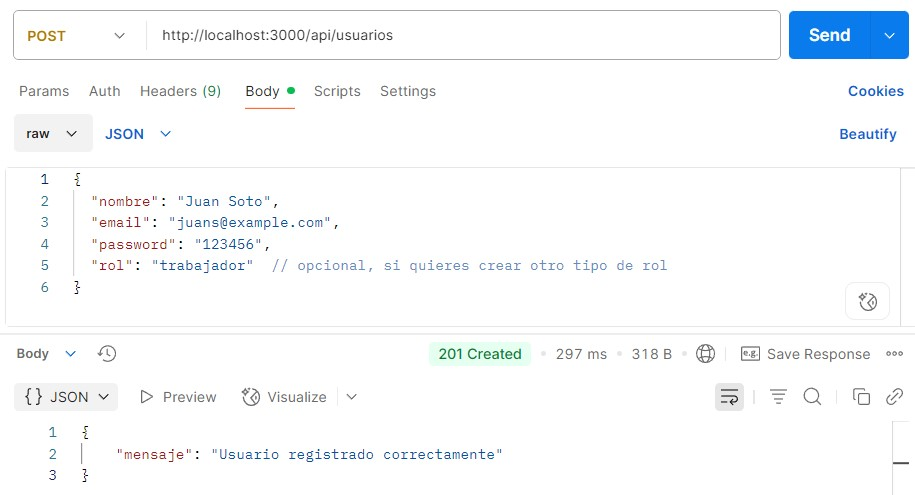
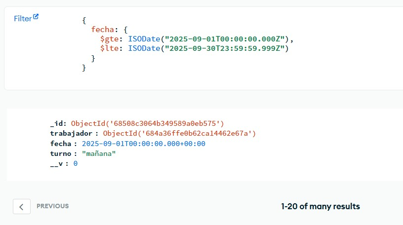

# 🛠️ Sistema de Gestión de Turnos Laborales

### 📚 Asignatura: Programación Back End  
**Unidad:** Desarrollo de Sistemas Backend Seguros y Escalables  
**Autor:** Patricio Nuñez

---

## 📌 Descripción

Este sistema permite gestionar la asignación automática y visualización de turnos laborales para una planta de trabajadores, garantizando condiciones como:
- Turnos rotativos de mañana y tarde.
- Dos días libres aleatorios por semana.
- Al menos 3 fines de semana libres al mes por trabajador.
- Mínimo 7 trabajadores por turno.

El acceso está protegido por autenticación JWT y se controla por roles (`admin` y `trabajador`).

---

## ⚙️ Tecnologías Utilizadas

- Node.js
- Express.js
- MongoDB Atlas
- JWT (JSON Web Tokens)
- Postman (para pruebas)
- dotenv

---

## 📂 Estructura del Proyecto

/TURNOSTRABAJADORES
├── controllers/
├── middleware/
├── models/
├── routes/
├── services/
├── .env.example
├── server.js
└── registrarTrabajadores.js

---

## 🚀 Cómo Ejecutar Localmente

1. **Clonar el repositorio:**
git clone https://github.com/potracio/turnos-backend.git
cd turnos-trabajadores

2. **Instalar dependencias:**
npm install

3. **Configurar variables de entorno:**
PORT=3000
MONGO_URI=mongodb+srv://<usuario>:<contraseña>@cluster.mongodb.net/TurnosDB
JWT_SECRET=miclavesecreta

3. **Ejecutar el servidor:**
node server.js

🔐 **Endpoints Importantes**
Método  	Ruta	                Descripción
POST	/api/auth/register	        Registrar usuario (admin o trabajador)
POST	/api/auth/login	            Iniciar sesión y obtener token
GET	    /api/usuarios	            Listar usuarios (admin)
POST	/api/turnos/asignar	        Asignar turnos del mes (admin)
GET	    /api/turnos/mis-turnos	    Ver turnos propios (trabajador)
GET	    /api/turnos/json	        Listar todos los turnos (admin)
PUT	    /api/turnos/:id         	Editar turno (admin)

🧪 **Pruebas con Postman**
Se creó una colección de pruebas que valida:
Registro e inicio de sesión.
Asignación de turnos.
Protección de rutas por rol.
Visualización y edición de turnos.

🌐 **Base de Datos en la Nube**
Se utilizó MongoDB Atlas para almacenar datos en la nube.
La conexión se establece a través del archivo .env y garantiza:
Accesibilidad remota
Escalabilidad básica
Separación de ambientes de desarrollo y producción

✅ **Estado**
✔️ Proyecto 100% funcional según los requisitos de la unidad.
✔️ Probado localmente con Postman y conectado a MongoDB Atlas.

📎 **Repositorio**
👉 Enlace a GitHub: https://github.com/potracio/turnos-backend

📜 **Licencia**
Uso académico. Todos los derechos reservados al autor.